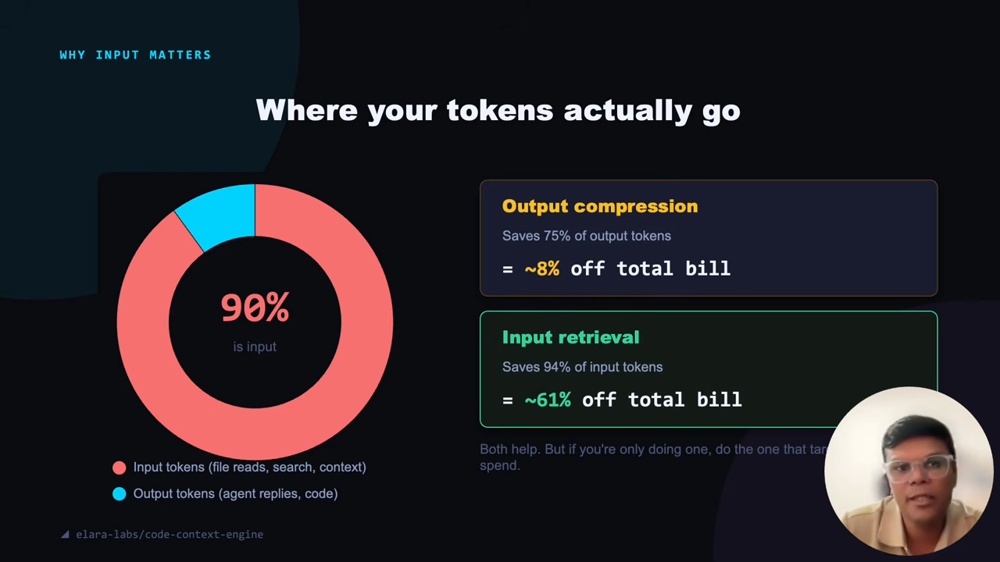
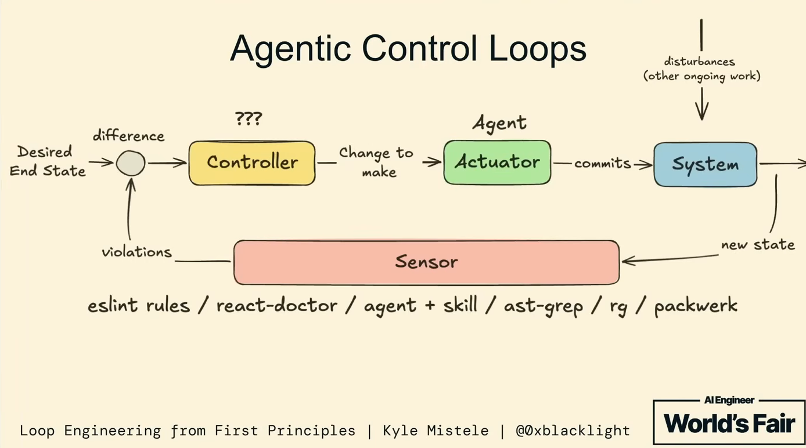
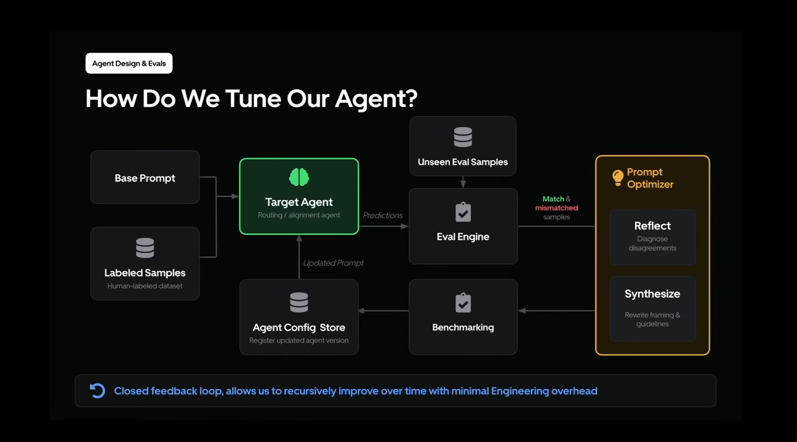
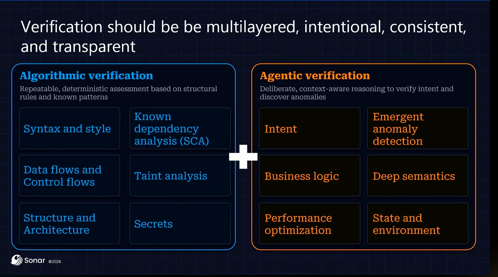
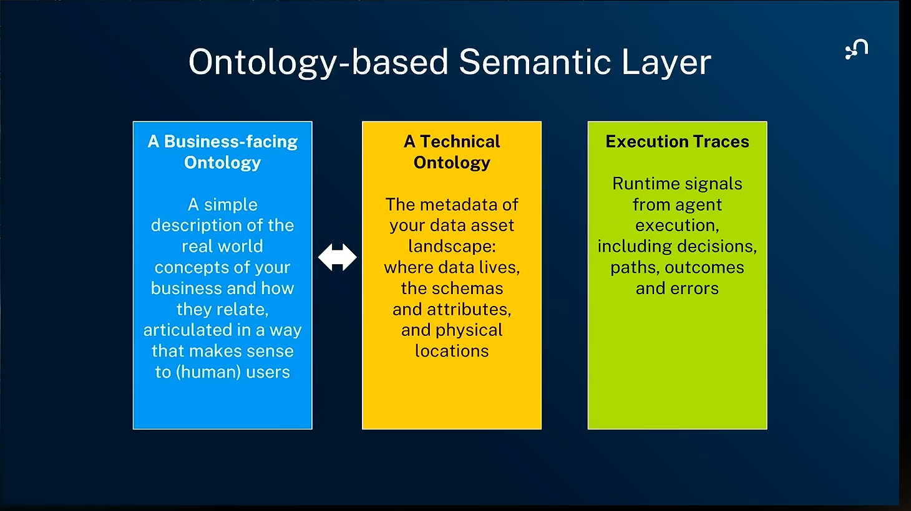

> A developer vibe-coding a side project a dozen people will ever run, and a team keeping a ten-year-old enterprise system alive for another quarter, share almost no constraints worth naming, and most of the advice in circulation is really one of those two people telling the other how to live.
> - [Addy Osmani](#osmani-constraints)

The AI development space changes so quickly it's hard to tell what's real and what's hype. Further complicating things, an approach can be valid for a lot of other folks' day to day, but not mine. It seems I regularly see a new project with 10K+ stars and say to myself, "Why would I ever need that?" The impetus for this post is my own desire to have some clarity on what seems to be working and when to apply it.

This post surveys current thoughts and patterns in AI engineering as of August 2026. It uses a number of videos from the [AI Engineer World's Fair](https://www.ai.engineer/worldsfair/2026) conference in San Francisco, a conference I've found to be a good proxy for the current state of the conversation. It also includes a number of AI engineering blog posts from various companies, as well as posts from practitioners that I've found high signal.

My goal is to convey accurate information about the current landscape and to provide [references](#references) of resources for others to learn from. I voice some personal opinions in order to spark discussion, but try to identify them as such. Let's dive in.

## The Agentic Era

> "we haven't even coalesced on a definition of what an agent is, even though we're well into the agentic era."
> - [Justin Schroeder, StandardAgents (2:12)](#schroeder-agentic-era)

Across everything I've watched and read, I don't know that I've seen even two people agree on the same definition of an Agent.

A few years ago most definitions of an Agent were roughly: LLM + memory + tools + planning + action. However, more recent definitions move the deterministic layer (tools, memory, etc) under the term harness. The definition of an Agent then becomes a harness plus the LLM it drives. Popular harnesses today include Claude Code, Codex, OpenCode, etc.

Splitting the harness from the LLM gives us a catch-all term to discuss that deterministic layer separate from the LLM. Folks using the same harness can author static configurations, allowing for version controlled experimentation or sharing.

### At Scale

A major benefit of the Agent abstraction can be realized once you adopt the constraint of "one task per Agent". Schroeder calls these [domain specific Agents](#schroeder-agentic-era). Domain specific Agents have been shown to have better overall performance on their task, as well as a reduced cost.

In addition to improved cost and performance, this small change allows us to think of Agents as functions that can be tested, parallelized, looped, and scaled. Techniques that software engineers have spent decades utilizing and building infrastructure around.

Topologies for Agent orchestration seem varied, often customized for the organization or task at hand. A few companies have seized on this trend, such as [Vercel](#vercel-ai-sdk) or [Anthropic](#anthropic-agent-sdk), by creating Agent management SDKs, turning Agents into something you can install.

Others opt for bespoke in-house solutions. [Cloudflare](#cloudflare-code-review) fans PR reviews to a panel of specialist Agents with a coordinating Agent managing them. [DoorDash](#doordash-cloud-agents) recently set up a cloud Agent platform, providing their developers with tools like sandboxes, an MCP gateway, and playbooks, letting teams run their own Agents.

## Context is Everything

> "the LLM is a new kind of a computer... it's kind of like the CPU equivalent. The context windows are kind of like the memory, and then the LLM is orchestrating memory and compute for problem solving."
> - [Andrej Karpathy (10:15)](#karpathy-cpu-memory)

An area of much discussion across all of these resources is the idea of curating the tokens you're sending to the LLM to be highly relevant to the task and as few as possible. This process used to be called prompting, but today broadly falls under the term context engineering or context management. The rationale for context engineering can be seen across a few different categories.

### Context Rot

Context Rot is the first of our categories, which was first introduced in a technical report by Chroma [Context Rot: How Increasing Input Tokens Impacts LLM Performance](#chroma-context-rot). The basic idea behind Context Rot is that more tokens measurably "distract" the LLM, as its attention is spread thinner across the increased tokens.

This means even though a model may support a context window of a million tokens, you likely don't want to be using even close to all of them.

> "If you're just getting started with AI, try to keep it around 100,000 tokens. For [a] larger million[-token] context window, we probably revise this up to like 200,000 tokens - but I've regularly tried to keep it under 60[k] for the hardest problems... One of the telltale signs that you're in the dumb zone is... you're 200,000 tokens in and the model's finished some work and it's trying to get the test to pass and it's like not [passing]."
> - [Dex Horthy, HumanLayer (28:36)](#horthy-dumb-zone)

This quote caught me off guard the first time I heard it, but the more I thought about it, the more it made sense. While long chat sessions can be good, we've all had those conversations where it's going great and then suddenly the LLM is forgetting things or hallucinating. I've actually added a warning to my Claude Code config that changes the context window to orange when I've reached 100k tokens, as a reminder to reset.

Another technique I've found useful for keeping chat sessions focused is heavy utilization of Claude Code's [subagents](#cc-subagents) and [dynamic workflows](#cc-workflows). I keep the main chat focused on the overall goal, i.e., "plan feature X", and have it spawn agents for anything that might distract it from that task. This can include things like reading code, exploring data in Snowflake, checking latency in Datadog, or even web searches. The subagents come back with the information we need to make a decision, and the main chat stays on track.

### Cost

The second category is the cost savings that come with using fewer tokens. Being deliberate about what gets sent to the model means less input cost as well as reduced back-and-forth cost (output).

Perhaps surprisingly, [Rajkumar Sakthivel (Tesco)](#tesco-token-index) found that for their coding tasks ~90% of the tokens are input (big codebase/context in, small diff out). Despite the fact that output tokens are priced 4-8x higher than input tokens, reducing input tokens worked out to roughly ~61% of their dollar bill.

*Where your tokens actually go ([Rajkumar Sakthivel, Tesco, 2:57](https://www.youtube.com/watch?v=dRmWYHuIJxM&t=177s))*

### Solutions In Practice

#### Skills

A popular solution to context management is skills. Skills have exploded onto the AI development scene and were the headline of several talks at the conference.

Skills are a markdown file spec created by Anthropic, that gives the LLM instructions on how to complete a task. Skills are an improvement over normal markdown files due to their utilization of progressive disclosure. Skills have a yaml metadata "frontmatter" that harnesses read, rather than the entire skill body. This metadata is then used to selectively load the skill content at runtime when the Agent deems it relevant.

> "If you do something ≥ once a week, make it a skill... Think of skills as workflows written in markdown."
> - [Eugene Yan](#yan-skills)

Anecdotally, skills have been incredibly valuable to the ML search team as day-to-day workflows. This includes things such as PR reviewing, data exploration, working with Datadog, and even Optimizely experiment generation.

However, skills aren't a silver bullet. [Philipp Schmid of Google DeepMind](#schmid-skills-evals) found that while human-generated skills improved model performance on task, AI-generated skills performed worse on tasks than a model with no skills at all.

Perhaps dating myself, I see skills as the AI generation's jQuery. Skills are an extremely useful abstraction for the problems we're having now. However, I suspect that in five or ten years we'll have different abstractions that can better model the nuances of working with Agents.

#### Compression

Another way to keep a lean context window is to utilize compression techniques to send the same information with fewer tokens. [Headroom](#headroom) does this via a proxy server, inspecting your outbound payload for code and compressing it. In addition to compression, Tesco passes only function names and descriptions rather than the entire thing.

> "Instead of sending whole files, the AI search[es] and index[es]. It gets back only [the] small piece of code it actually needs."
> - [Rajkumar Sakthivel, Tesco (3:25)](#tesco-code-index)

[Toon](#toon) takes a different approach to compression, opting to replace JSON with a structured data format explicitly designed to use fewer tokens. Projects like [AXI](#axi) take this a step further, creating a set of rules for building CLI tools and MCP servers in a way that measurably uses fewer tokens.

#### Long Term Memory

> "every company on this earth is about to need a brain - the memory layer that means you never have to re-ask what you knew."
> - [Garry Tan, Y Combinator (17:22)](#tan-company-brain)

Since LLM sessions are stateless, important data must be persisted in some form. While sometimes a pain, this has the added benefit of allowing us to pick and choose only the most important information for the context window.

I've seen this show up in a few places as the "Company Brain". Y Combinator believes all companies need to create a [company brain](#tan-company-brain). [Cloudflare](#cloudflare-standards) built a company brain when they realized that institutional knowledge ["became harder to recover when people moved between teams."](#cloudflare-knowledge-recovery) [Eugene Yan](#yan-working) puts it simply: "Connect models to your organization's context".

The simplest way to do this is via a folder on your disk, some sort of Markdown vault (Obsidian, Tolaria, etc.), or per-project markdown documentation. However, the markdown-as-memory approach comes with its own pitfalls. Cloudflare notes that markdown memory "rots incredibly fast" and requires constant updates as things change. Personally I've had Claude recite "facts" to me on a number of occasions that can be traced to an outdated markdown file or code comment somewhere.

Another markdown pitfall is that it's easy to load the whole document into context when only a small subset is required. Common ways to avoid this are to have the Agent use `grep`, `tail`, `head` or `jq` to parse relevant data from files. [`ast-grep`](#ast-grep) is useful for codebases, allowing Agents to seek out specific programming language patterns. Cloudflare takes a different approach for the Codex brain, parsing relevant statements out and loading only those into Codex.

Non-markdown long term memory options are also gaining in popularity. These include projects such as [Letta](https://github.com/letta-ai/letta), [Mem0](https://github.com/mem0ai/mem0), or [Zep](https://github.com/getzep/zep). The materials I reviewed for this post don't really cover these. At a glance most seem to be abstractions on top of databases and vector embeddings that allow an Agent to access information semantically.

## Loops

> "My job is to write loops."
> - [Boris Cherny, creator of Claude Code (Anthropic)](#cherny-write-loops)

I'm almost certain everyone reading this knows what a loop is. It's so ingrained into our day to day that we overlook that almost everything can be reduced to a loop. The AI development space has been rediscovering loops lately.

I see AI Agent loops as largely falling under two categories: what I call the Agent loop and the Improvement loop.

### Agent Loop

The Agent loop is about having a single Agent iterate until it has achieved a given task. This doesn't necessarily have to be writing code. [Uber Eats](#uber-closed-loop) uses multi-modal Agent loops to augment product images.

[Kyle Mistele of HumanLayer](#mistele-loop-engineering) maps the Agent loop onto classical systems design control loop:

*Agentic control loops ([Kyle Mistele, HumanLayer](https://www.youtube.com/watch?v=xIt_mTQp6mY&t=276s))*

We give the Agent loop our desired state, which is then compared to the current state, generating a list of changes. The controller, usually heuristics or perhaps the Agent itself, selects a change to make. The Agent executes the change and commits it as the "new state". The changes are run through a set of sensors (validators) and any violations are surfaced to the controller. A new Agent, with a fresh context window, picks up the next task and the loop repeats until the desired state is reached.

Giving an Agent loop a set of well-defined tasks and letting it run through them is an effective way to iterate towards a desired goal. As we saw in the previous section, a fresh context window helps keep the Agent task focused. However, if you don't give the Agent some form of deterministic guardrails, it can quickly spiral out of control.

[The Great Loops Debate](#great-loops-debate) has panelists argue points from opposite ends of the autonomy curve. Geoff Huntley (creator of the Ralph loop) and Ian Livingstone (Keycard) argue for the YOLO version of the Agent loop (Ralph Wiggum, /goal) where the Agent decides when the loop is completed. Dex Horthy (HumanLayer) and Greg Pstrucha (Sentry) argue that a human needs to decide when the loop is complete, citing non-deterministic LLM behavior. It's worth noting that both sides agree that deterministic validation is important in agentic loops.

> "I heavily exploit pre-commit hooks, folks... and I engineer in that back pressure by analyzing the work that is done."
> - [Geoff Huntley (30:47)](#huntley-precommit)

Personally, I think both types of loops have their place. Goal loops can be incredibly valuable for vibe coding one-off scripts or standing up a greenfield project. However, if I have to maintain critical systems or ship code at scale, I think I want a human in the loop.

### Improvement Loop

The Improvement loop operates at a meta-level, across multiple iterations of an Agent. The output of the Agent loop is assessed on task performance and future iterations of the Agent loop are modified with the goal of improved performance on the task.

A real-world example of the Improvement loop is [Uber Eats' Agent tuner](#uber-closed-loop):

*How Uber tunes an Agent ([Soumya Gupta & Jai Chopra, Uber](https://www.youtube.com/watch?v=31GUkCBD-Uc&t=787s))*

Their Agent is fed a base prompt and human-labeled data. It performs a task, in this case choosing what images a user sees, and the output is scored against unseen samples. A different Agent suggests changes to the prompt for the initial Agent, and the loop starts over. This loop itself is part of a larger pipeline run on real-time user data, allowing Uber to ship improved Agent loops in near real-time.

[Annabell Schäfer](#schafer-langfuse) shows how Langfuse used an Improvement loop to have a large model (Opus 4.8) improve a smaller model's (GPT-5.4 nano) performance on a classification task. The large model's prompt changes are seeded via human domain knowledge.

[Lilian Weng](#weng-harness) has an excellent survey of current research into Agent harness Improvement loops. Some papers continue refinement via prompt and context adjustments. Others move to an even higher level, experimenting with loops that modify harness code or model weights.

## Taming the Stochastic Core

> "People worry about hallucinations, but that's the feature... We hallucinate in a way. We imagine things that may not exist, and then we turn them into reality. And that's what large language models do."
> - [Frank Coyle, UC Berkeley (5:05)](#coyle-hallucination-feature)

Code is deterministic. Given the same inputs you'll get the same outputs. This is something software developers rely on every day: Does this code compile? Do my tests pass? The LLM core of an Agent is non-deterministic, making it difficult to guarantee it will do what you expect. As we'll see, the AI development community utilizes both deterministic and non-deterministic methods together to keep Agents pointed in the right direction.

*Verification should be multilayered ([Tariq Shaukat, Sonar, 12:06](https://www.youtube.com/watch?v=VrpEyglYgeU&t=726s))*

### Tests, Linters, and Compilers

> "I think of verification as a ladder. The bottom is cheap and deterministic; the top is expensive and requires judgement."
> - [Eugene Yan](#yan-verification-ladder)

Our existing deterministic verifiers allow us to perform a reliable "this must pass" check on LLM output. Since by definition deterministic checks are repeatable and reliable, any check that can be made deterministic in an Agent loop likely should be.

As we saw in [the agent loop diagram above](#agent-loop-diagram), the same compilers, tests, and linters that we use day to day are part of the Agent loop definition. Geoff Huntley recommends utilizing git pre-commit hooks as a window to catch violations, and `echo` "prompts" back to the Agent, letting it know where the boundary is.

### Ontologies

An ontology is a deterministic rules layer that sits on top of a fact-based data graph. These rules define valid data types and relationships, giving a deeper semantic meaning to the data. Take this example of a teacher-student relationship:

> "So if I say teaches has a domain of teacher, that means if I say 'Bob teaches Scooter' in my text, I can infer that Bob is a teacher. And if I say 'all teachers are persons,' then this statement lets me know, if I say 'Bob teaches Scooter,' now I know Bob is a person, Bob is a teacher. What about Scooter? If I say teaches has a range of student, that means the right side of the verb, then Scooter is a student. And now I have this extra information into my system."
> - [Frank Coyle, UC Berkeley (10:09)](#coyle-teaches-domain-range)

An Agent can construct a structured statement that is then deterministically fact-checked by the ontology. Coyle discusses two ontology specifications which were designed for the early semantic web over 20 years ago. [RDFS](#rdfs) defines a language for schema and vocabulary. [OWL](#owl) builds on top of RDFS adding richer ontology axioms.

[Emil Eifrem of Neo4j](#eifrem-substrate) posits that every business needs an ontology substrate with three pillars:

*Ontology-based semantic layer, three pillars ([Emil Eifrem, Neo4j, 6:12](https://www.youtube.com/watch?v=VGN22pPpb-8&t=372s))*

This ontology substrate prevents teams from needing to re-discover their information sources every time they build an Agent. It's the data version of keeping your code DRY.

Both ontology talks outline two methods of building ontologies. The top-down approach is where domain experts define entities and their relationships. The bottom-up approach takes existing production execution traces and codifies them into ontologies.

### Evals

> "Code is provable, but when you start dealing with large code bases, software is not. It's still very complex. It is still very messy."
> - [Tariq Shaukat, Sonar (7:45)](#shaukat-code-provable)

Evals are a set of tests you run on Agent outputs to measure how well a given Agent configuration is doing on a task over time. They play a critical part in the Improvement loop. Low initial evals are not necessarily bad. Rather, they highlight areas for improvement. With proper tuning an Agent can improve its eval pass rate over time.

Uber considers human labels the source of truth for use in their evals. They give human labelers an objective guideline for labeling data that is usually in a simple form (yes, no, unsure).

When building evals it's important to use real-world data. This can include obvious examples like user signals, but can also include less obvious sources such as logs or system traces. Uber logs as much data as they can, allowing them to map production data to user segments where the Agent can improve.

A pitfall to watch out for with evals comes in the form of reward hacking, where the Agent learns how to game the metric rather than complete the task. This can even include scenarios such as Agents looking up prior runs to cheat ([Schmid, 18:48](#schmid-skills-evals)). Lilian Weng's [article](#weng-harness) advises combatting reward hacking with a gating secondary "held-out" eval set that the Agent cannot see. Uber does something similar with a secondary recall guardrail metric, preventing the Agent from regressing in other areas to pass a specific eval.

### Models Watching Models

One of the more popular forms of non-deterministic validation is using one LLM to grade the output of a different LLM against a given criterion. This process is often referred to as LLM as a Judge. Teams often reach for this form of verification when a grading task is complex or doesn't necessarily have a verifiable correct answer.

LLM as a Judge shouldn't be used lightly, however. Its non-deterministic nature means that a judge could pass an input one run and fail it the next. Cloudflare builds resilience into their judge architecture by having a panel of specialized judge Agents that feed verdicts to a coordinating Agent responsible for the final judgment. Judge model architectures also have the hidden overhead of needing an Improvement loop, evals, and data to ensure alignment to the task.

# References

## Talks

### The Future Is Domain-Specific Agents

Justin Schroeder, StandardAgents · AI Engineer World's Fair 2026 · [https://www.youtube.com/watch?v=spNAUEgq_A8](https://www.youtube.com/watch?v=spNAUEgq_A8)

- [We're well into the "agentic era" without even agreeing on what an agent is](https://www.youtube.com/watch?v=spNAUEgq_A8&t=132s) (2:12)

### The Great Loops Debate (panel)

Dex Horthy (HumanLayer), Geoff Huntley, Ian Livingstone (KeyCard), Greg Pstrucha (Sentry) · moderated by Allie Howe (Insecure Agents) · AI Engineer World's Fair 2026 · [https://youtu.be/c35YoMdnI78](https://youtu.be/c35YoMdnI78)

- [Keep context small: the token budgets that keep you out of the "dumb zone"](https://youtu.be/c35YoMdnI78?t=1716s) (~28:36)
- [Engineering back-pressure into the loop with pre-commit hooks that echo the boundary back to the agent](https://youtu.be/c35YoMdnI78?t=1847s) (30:47)

### We Cut 94% of AI Coding Tokens With a Local Code Index

Rajkumar Sakthivel, Tesco · AI Engineer World's Fair 2026 · [https://www.youtube.com/watch?v=dRmWYHuIJxM](https://www.youtube.com/watch?v=dRmWYHuIJxM)

- [Where coding-agent tokens actually go (~90% input), and how a local code index slashed them](https://www.youtube.com/watch?v=dRmWYHuIJxM&t=169s) (2:49)
- [On the local code index: searching and indexing so the Agent gets back only the slice of code it needs, not whole files](https://www.youtube.com/watch?v=dRmWYHuIJxM&t=205s) (3:25)

### Don't Ship Skills Without Evals

Philipp Schmid, Google DeepMind · AI Engineer World's Fair 2026 · [https://www.youtube.com/watch?v=0vphxNt4wyk](https://www.youtube.com/watch?v=0vphxNt4wyk)

- [Why you shouldn't ship skills without evals, including agents that learn to game the metric](https://www.youtube.com/watch?v=0vphxNt4wyk&t=1128s) (18:48)

### Every company should have a Brain

Garry Tan, Y Combinator · AI Engineer World's Fair 2026 · [https://www.youtube.com/watch?v=eBUyTS7SzV4](https://www.youtube.com/watch?v=eBUyTS7SzV4)

- [Why every company will need a "brain": a persistent memory layer so you never re-ask what you already knew](https://www.youtube.com/watch?v=eBUyTS7SzV4&t=1042s) (17:22)

### Building Closed-Loop Evals for a Multimodal Agent at Scale

Soumya Gupta & Jai Chopra, Uber · AI Engineer World's Fair 2026 · [https://www.youtube.com/watch?v=31GUkCBD-Uc](https://www.youtube.com/watch?v=31GUkCBD-Uc)

- [A closed-loop eval system that diagnoses failing agents and auto-tunes them from production feedback](https://www.youtube.com/watch?v=31GUkCBD-Uc&t=787s) (13:07)

### Loop Engineering from First Principles

Kyle Mistele, HumanLayer · AI Engineer World's Fair 2026 · [https://www.youtube.com/watch?v=xIt_mTQp6mY](https://www.youtube.com/watch?v=xIt_mTQp6mY)

- [The agent loop drawn as a classical control loop: desired state, controller, actuator, sensor, and violations fed back](https://www.youtube.com/watch?v=xIt_mTQp6mY&t=276s) (4:36)

### Stop Burning Tokens: Why self-improvement needs domain expertise first

Annabell Schäfer, Langfuse · AI Engineer World's Fair 2026 · [https://www.youtube.com/watch?v=eAXxdtNlK04](https://www.youtube.com/watch?v=eAXxdtNlK04)

- [Using a large model to improve a small model's classifier, seeded with human domain knowledge](https://www.youtube.com/watch?v=eAXxdtNlK04&t=308s) (5:08)

### Why Agentic Systems Need Ontologies

Frank Coyle, UC Berkeley · AI Engineer World's Fair 2026 · [https://www.youtube.com/watch?v=Sir59K8ZDPU](https://www.youtube.com/watch?v=Sir59K8ZDPU)

- [Reframing hallucination as the feature: imagining things that don't exist yet, then turning them into reality](https://www.youtube.com/watch?v=Sir59K8ZDPU&t=305s) (5:05)
- [How an ontology's domain and range rules let you infer new facts (the Bob/Scooter teacher-student example)](https://www.youtube.com/watch?v=Sir59K8ZDPU&t=609s) (10:09)

### Thinner Agents on a Smarter Substrate: The Ontology-based Semantic Layer

Emil Eifrem, Neo4j · AI Engineer World's Fair 2026 · [https://www.youtube.com/watch?v=VGN22pPpb-8](https://www.youtube.com/watch?v=VGN22pPpb-8)

- [Why every business needs a shared ontology substrate (three pillars) so agents stop rediscovering the same data sources](https://www.youtube.com/watch?v=VGN22pPpb-8&t=483s) (8:03)
- [The full three-pillars semantic-layer slide: a business-facing ontology, a technical ontology, and execution traces](https://www.youtube.com/watch?v=VGN22pPpb-8&t=372s) (6:12)

### In the Land of AI Agents, the Verifiers Are King

Tariq Shaukat, Sonar · AI Engineer World's Fair 2026 · [https://www.youtube.com/watch?v=VrpEyglYgeU](https://www.youtube.com/watch?v=VrpEyglYgeU)

- [Why code is provable but large software systems are not, and what that means for verifying agents](https://www.youtube.com/watch?v=VrpEyglYgeU&t=465s) (7:45)

### Harness Engineering is not Enough: Why Software Factories Fail

Dex Horthy, HumanLayer · AI Engineer World's Fair 2026 · [https://www.youtube.com/watch?v=Ib5GBkD555M](https://www.youtube.com/watch?v=Ib5GBkD555M)

- [On why the human review-and-test step is still the bottleneck even as the build step gets faster](https://www.youtube.com/watch?v=Ib5GBkD555M&t=376s) (6:16)

### I Run a Fleet of AI Agents Across Three Machines. Here's What Broke.

Kyle Jaejun Lee, KRAFTON · AI Engineer World's Fair 2026 · [https://www.youtube.com/watch?v=4kYl2_mqmnQ](https://www.youtube.com/watch?v=4kYl2_mqmnQ)

- [Hard-won lessons running a fleet of agents across three machines, and what broke](https://www.youtube.com/watch?v=4kYl2_mqmnQ&t=82s) (1:22)

### The Unreasonable Effectiveness of Separating the Task from the Model

Maxime Rivest & Isaac Miller · AI Engineer World's Fair 2026 · [https://www.youtube.com/watch?v=GgLQ02aO-hs](https://www.youtube.com/watch?v=GgLQ02aO-hs)

### Full Workshop: Setting Yourself Up for Success

Jason Liu, OpenAI Codex · AI Engineer World's Fair 2026 · [https://www.youtube.com/watch?v=il1c1a2FufU](https://www.youtube.com/watch?v=il1c1a2FufU)

### Active Graph Agent Runtime (BabyAGI 4)

Yohei Nakajima, Untapped Capital · AI Engineer World's Fair 2026 · [https://www.youtube.com/watch?v=khVX_BUnEwU](https://www.youtube.com/watch?v=khVX_BUnEwU)

## Written

### Addy Osmani

- **Vibe-coding "no shared constraints" quote** (Addy Osmani, @addyosmani, 2026-06-15) · tweet: [https://x.com/addyosmani/status/2066595308629594363](https://x.com/addyosmani/status/2066595308629594363)

### Cloudflare

Shared by Nate Strandberg in [#guild-ai](https://weedmaps.slack.com/archives/CB4V0PTT2) on 2026-08-06 ([thread](https://weedmaps.enterprise.slack.com/archives/CB4V0PTT2/p1786045523233959?thread_ts=1786045523.233959&cid=CB4V0PTT2)).

- **How Cloudflare enforces engineering standards using AI** - Timo Reimann · [https://blog.cloudflare.com/engineering-standards-enforcement/](https://blog.cloudflare.com/engineering-standards-enforcement/)
  - ["Institutional knowledge became harder to recover when people moved between teams, and guidance that was not consistently surfaced or enforced led to drift between projects."](https://blog.cloudflare.com/engineering-standards-enforcement/)
  - Takeaways
    - Graph ontology based on specs
    - Rule based brain
      - coding pillar
    - Non deterministic from what I can tell
- **Orchestrating AI Code Review at scale** - Ryan Skidmore · [https://blog.cloudflare.com/ai-code-review/](https://blog.cloudflare.com/ai-code-review/)

### DoorDash Engineering

- **Delegating Engineering Work to Cloud-Based Agents** (Flux, DoorDash Engineering / @AIatDoorDash, 2026-08-11) · [https://x.com/AIatDoorDash/status/2087284229751394705](https://x.com/AIatDoorDash/status/2087284229751394705)
  - In-house cloud agent platform: Firecracker microVM sandboxes, an MCP "Agent Gateway" with scoped per-playbook permissions, reusable YAML "playbooks" (mixing agentic and deterministic steps), and multi-surface invocation (Slack, GitHub, cron, CLI). DoorDash-reported scale: 130k automated engineering tasks/month, 25k+ code reviews/week. Thesis: writing code is mostly solved; the value is the harness/infrastructure around the agent. Started narrow with code review to earn trust.

### Andrej Karpathy

- **Software Is Changing (Again)** (YC AI Startup School, 2025-06-17) · [https://www.youtube.com/watch?v=LCEmiRjPEtQ](https://www.youtube.com/watch?v=LCEmiRjPEtQ)
  - ["the LLM is a new kind of a computer... it's kind of like the CPU equivalent. The context windows are kind of like the memory, and then the LLM is orchestrating memory and compute for problem solving."](https://www.youtube.com/watch?v=LCEmiRjPEtQ&t=615s)
  - Iron Man suit / human-in-the-loop analogy starts at **27:50** → [https://www.youtube.com/watch?v=LCEmiRjPEtQ&t=1670s](https://www.youtube.com/watch?v=LCEmiRjPEtQ&t=1670s)

### Chroma

- **Context Rot: How Increasing Input Tokens Impacts LLM Performance** - Kelly Hong, Anton Troynikov, Jeff Huber (Chroma Technical Report, 2025-07-14) · [https://research.trychroma.com/context-rot](https://research.trychroma.com/context-rot)

### Eugene Yan

- **How to Work and Compound with AI** (2026-05) · [https://eugeneyan.com/writing/working-with-ai/](https://eugeneyan.com/writing/working-with-ai/)
  - ["If you do something ≥ once a week, make it a skill… Think of skills as workflows written in markdown."](https://eugeneyan.com/writing/working-with-ai/)
  - ["I think of verification as a ladder. The bottom is cheap and deterministic; the top is expensive and requires judgement."](https://eugeneyan.com/writing/working-with-ai/)

### Boris Cherny

- **"My job is to write loops"** (Claude Code & the Future of Engineering, Acquired Unplugged / WorkOS, ~June 2026) · clip: [https://x.com/Av1dlive/status/2064321381953675599](https://x.com/Av1dlive/status/2064321381953675599)
  - ["My job is to write loops."](https://x.com/Av1dlive/status/2064321381953675599)

### Lilian Weng

- **Harness Engineering for Self-Improvement** (Lil'Log, 2026-07-04) · [https://lilianweng.github.io/posts/2026-07-04-harness/](https://lilianweng.github.io/posts/2026-07-04-harness/)

### Kun Chen

- **firstmate** · [https://github.com/kunchenguid/firstmate](https://github.com/kunchenguid/firstmate)
- **no-mistakes** · [https://github.com/kunchenguid/no-mistakes](https://github.com/kunchenguid/no-mistakes)
- **YouTube** · [https://www.youtube.com/@kunchenguid](https://www.youtube.com/@kunchenguid)
- **L8 Principal's Agentic Engineering Workflow** (walkthrough) · [https://www.youtube.com/watch?v=iQyg-KypKAA](https://www.youtube.com/watch?v=iQyg-KypKAA)

### Steve Yegge / Gas Town

- **Welcome to Gas Town** (blog) · [https://steve-yegge.medium.com/welcome-to-gas-town-4f25ee16dd04](https://steve-yegge.medium.com/welcome-to-gas-town-4f25ee16dd04)
- **Gas City** (repo, gastownhall/gascity) · [https://github.com/gastownhall/gascity](https://github.com/gastownhall/gascity)

### Artificial Analysis

- **Artificial Analysis** - independent, continuously-updated LLM model & provider benchmarks (Intelligence Index, price per token, speed/throughput, context window, open weights) · [https://artificialanalysis.ai](https://artificialanalysis.ai)

## Tools & Specs

- **AI SDK** (Vercel) - TypeScript toolkit for building AI apps and agents across model providers · [https://ai-sdk.dev/docs/introduction](https://ai-sdk.dev/docs/introduction)
- **Anthropic Claude Agent SDK** - Anthropic's SDK for building agents on the Claude Code harness (built-in tools, agent loop, context management, MCP, subagents) · [https://code.claude.com/docs/en/agent-sdk](https://code.claude.com/docs/en/agent-sdk)
- **Claude Code subagents** · [https://code.claude.com/docs/en/sub-agents](https://code.claude.com/docs/en/sub-agents)
- **Claude Code dynamic workflows** · [https://code.claude.com/docs/en/workflows](https://code.claude.com/docs/en/workflows)
- **headroom** · [https://github.com/headroomlabs-ai/headroom](https://github.com/headroomlabs-ai/headroom) · via [Randy Brown](https://weedmaps.enterprise.slack.com/archives/CB4V0PTT2/p1785792408333809?thread_ts=1785792408.333809&cid=CB4V0PTT2)
- **Token-Oriented Object Notation** · [https://toonformat.dev/](https://toonformat.dev/)
- **axi** · [https://axi.md/](https://axi.md/) · repo: [https://github.com/kunchenguid/axi](https://github.com/kunchenguid/axi)
- **ast-grep** · [https://ast-grep.github.io/](https://ast-grep.github.io/)
- **RDF Schema (RDFS)** · [https://www.w3.org/TR/rdf-schema/](https://www.w3.org/TR/rdf-schema/)
- **Web Ontology Language (OWL 2)** · [https://www.w3.org/TR/owl2-overview/](https://www.w3.org/TR/owl2-overview/)
